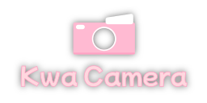
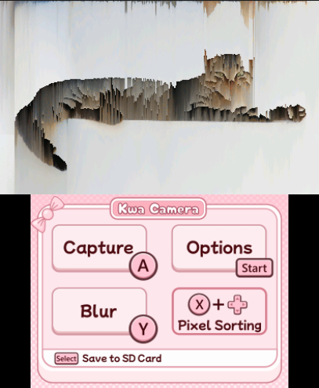

  

<h1 align="center">A silly little homebrew pixel sorting camera for taking glitch art photos with a 3DS</h1>

  

## Features:
- Configurable Pixel sorter, sort by brightness or color channels.
- Pixel sorter thresholding, only sort pixels above or below specified threshold.
- Kernel blur

Photos are saved to the SD card in the `3ds/KwaCam/Captures` folder as bitmap .bmp files.

## Controls
- A: Take photo
- Y + D-Pad / Analog Stick: Sort Pixels
- X: Blur photo
- Start: Open config menu
- Select: Save photo to SD card

## Installation
⚠️ Warning, I'm new 3ds development and a lot of chat gpt was used in building this app! ⚠️

Requires 3ds with Custom Firmware

**Option 1: CIA (Install to Home Menu)**
1. Copy the `KwaCam.cia` file to your 3DS's SD card.
2. Install via [FBI](https://github.com/Steveice10/FBI).
3. **Important for Audio:** Your 3DS needs its DSP firmware dumped to play audio. (`Left Shoulder + D-Pad Down + Select`) -> `Misc options` -> `Dump DSP Firmware`.

**Option 2: 3DSX (Run via Homebrew Launcher)**
1. Copy the `KwaCam.3dsx` file into `sdmc:/3ds/` (or `sdmc:/3ds/KwaCam/` if preferred).
2. Launch the app through the Homebrew Launcher.
3. **Important for Audio:** Your 3DS needs its DSP firmware dumped to play audio. (`Left Shoulder + D-Pad Down + Select`) -> `Misc options` -> `Dump DSP Firmare`.

## Building
This project requires [devkitPro](https://devkitpro.org/wiki/Getting_Started) to compile.
1. Download devkit pro with 3ds configuration: https://devkitpro.org/wiki/Getting_Started
2. Run `Build_3dsx.bat` to build.

Building cia requires [makerom.exe](https://github.com/3DSGuy/Project_CTR/releases), and [bannertool.exe](https://github.com/Epicpkmn11/bannertool/releases) to be placed in the `External` folder

⚠️ Warning, I'm new 3ds development and a lot of chat gpt was used in building this app! ⚠️

## Credits
- Developed by Keira RK.
- Project heavily uses the devkitpro team's 3ds tools - https://devkitpro.org/ Thank you to them ❤️!

## License
Was too lazy to include a license, but I pinky promise you can use my SVG's, main.c code, the build scripts, and my project structure as templates for whatever! (just please don't sell my assets as part of an asset pack!). Button icon templates are found in `Art/InterfaceDesign.svg`